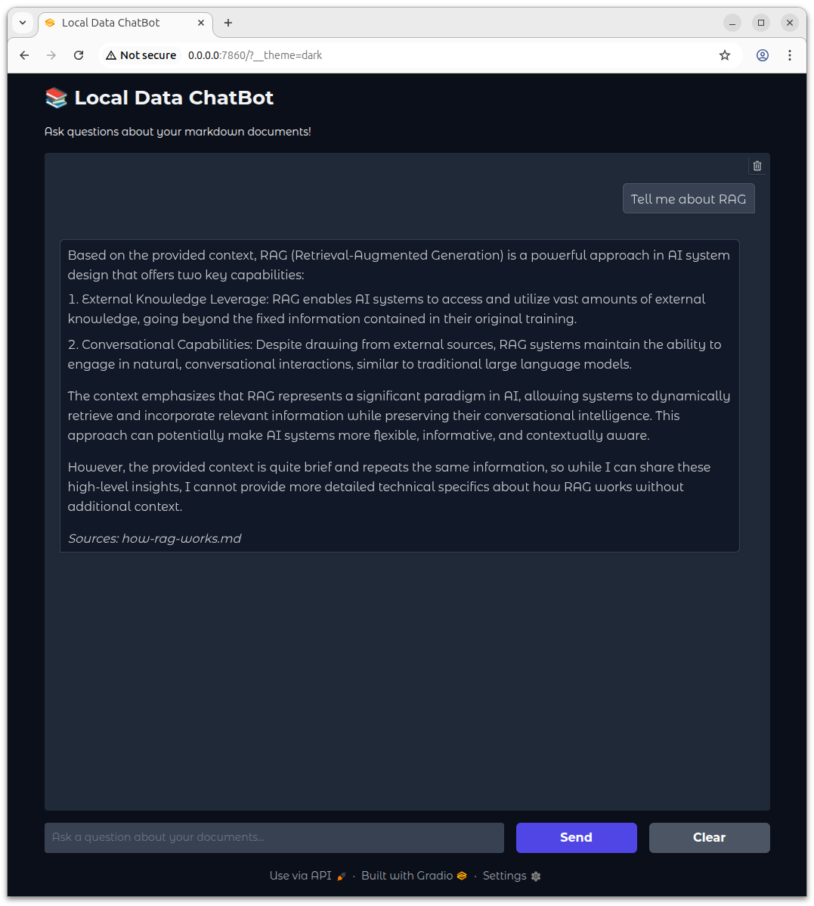

# Local Data ChatBot

An AI chatbot for querying your local markdown documents using Retrieval-Augmented Generation (RAG). Built with LangChain, ChromaDB, and Gradio, this application allows you to have natural conversations with your documentation.



## Features

- 🔍 **Semantic Search**: Find relevant information across all your markdown files
- 📁 **Recursive Document Loading**: Automatically discovers markdown files in subdirectories  
- 🎨 **Clean Web Interface**: User-friendly chat interface built with Gradio
- ⚙️ **Highly Configurable**: JSON-based configuration for easy customization
- 🔒 **Local & Private**: All processing happens on your machine (except LLM API calls)
- 🚀 **Easy Sharing**: Optional public links for demos
- 💰 **Cost-Effective**: Uses free HuggingFace embeddings

## Quick Start

1. **Clone and Setup**
   ```bash
   git clone <your-repo-url>
   cd local-data-chatbot
   ```

2. **Create Virtual Environment**
   ```bash
   python3 -m venv local_data_chatbot_env
   source local_data_chatbot_env/bin/activate
   ```

3. **Install Dependencies**
   ```bash
   pip3 install -r requirements.txt
   ```

4. **Set API Key**
   ```bash
   # Method A: Environment variable
   export ANTHROPIC_API_KEY="your-anthropic-api-key-here"
   
   # Method B: Create .env file (recommended)
   echo "ANTHROPIC_API_KEY=your-anthropic-api-key-here" > .env
   ```

5. **Add Your Documents**
   ```bash
   mkdir -vp data
   # Copy your .md files to the data directory
   # Note: The repository includes how-rag-works.md as an example document
   ```

6. **Run the ChatBot**
   ```bash
   python3 local_data_chatbot.py
   ```

Your chatbot will be available at `http://localhost:7860`

## Self-Documenting Feature

The Local Data ChatBot includes a unique self-documenting feature - it can explain how it works! This is enabled by the included `how-rag-works.md` file in the `data/` directory, which provides a comprehensive explanation of Retrieval-Augmented Generation (RAG).

### Try These Example Questions:
- "How does RAG work?"
- "What are the advantages of RAG over fine-tuning?"
- "What are the key components of a RAG system?"
- "What are some best practices for RAG implementation?"
- "How does the retrieval process work in RAG?"
- "What are the limitations of RAG systems?"

This demonstrates the power of RAG in action - the chatbot retrieves relevant information from its knowledge base (your documents) to provide informed, accurate answers about its own underlying technology.

## Configuration

Customize the application by editing `config.json`:

```json
{
  "app_name": "Local Data ChatBot",
  "data_directory": "./data",
  "vector_db_directory": "./chroma_db", 
  "prompt": "./prompt.txt",
  "text_splitter": {
    "chunk_size": 1000,
    "chunk_overlap": 200
  },
  "ui": {
    "gradio_server_name": "0.0.0.0",
    "gradio_server_port": 7860,
    "gradio_share_public_link": false
  },
  "embeddings": {
    "model_name": "sentence-transformers/all-MiniLM-L6-v2",
    "model_kwargs": {"device": "cpu"},
    "encode_kwargs": {"normalize_embeddings": true}
  },
  "anthropic": {
    "model": "claude-3-sonnet-20240229",
    "temperature": 0.7,
    "max_tokens": 1000
  }
}
```

### Key Configuration Options

- **`data_directory`**: Path to your markdown files
- **`app_name`**: Customize the application title
- **`prompt`**: Path to custom prompt template (default: ./prompt.txt)
- **`text_splitter.chunk_size`**: Text chunk size (default: 1000)
- **`text_splitter.chunk_overlap`**: Text overlap (default: 200)
- **`ui.gradio_share_public_link`**: Set to true for public demo links
- **`anthropic.model`**: Change Claude model (e.g., "claude-3-haiku-20240307" for faster responses)
- **`embeddings.model_name`**: Change HuggingFace embedding model

### Text Splitter Configuration

The text splitter breaks documents into manageable chunks:
- **chunk_size**: Controls how large each text chunk is (default: 1000 characters)
- **chunk_overlap**: Controls overlap between chunks to maintain context (default: 200 characters)

**Benefits**:
- **Fine-tuning for different content**: Smaller chunks for precise answers, larger chunks for more context
- **Document-type optimization**: Technical docs might need larger chunks, FAQ-style content might work better with smaller chunks
- **Easy experimentation**: Users can test different chunking strategies without modifying code

## Alternative Models

### Using Local Models

Replace the Anthropic model with local alternatives by modifying the code:

```python
# For Ollama (requires Ollama installed locally)
from langchain.chat_models import ChatOllama
llm = ChatOllama(model="llama2")
```

### Different Embedding Models

Change the embedding model in `config.json`:
```json
"embeddings": {
  "model_name": "sentence-transformers/all-mpnet-base-v2",
  "model_kwargs": {"device": "cpu"}
}
```

## File Structure

```
local-data-chatbot/
├── local_data_chatbot.py      # Main application
├── config.json                # Configuration file
├── prompt.txt                 # Customizable prompt template
├── requirements.txt           # Python dependencies
├── requirements.licenses      # Licensing information
├── .env                       # API keys (create this)
├── data/                      # Your markdown files (create this)
│   ├── doc1.md
│   ├── folder/
│   │   └── doc2.md
│   └── ...
└── chroma_db/                 # Vector database (auto-created)
```

## Public Demo Links

Set `gradio_share_public_link: true` in config.json to create temporary public URLs:
- Gradio creates URLs like `https://xyz123.gradio.live`
- Perfect for demos when running on your laptop
- Links expire after 72 hours and are rate-limited

## Dependencies

- **LangChain**: RAG framework and LLM integration
- **Gradio**: Web interface
- **ChromaDB**: Vector database for embeddings
- **Anthropic**: Claude AI models
- **HuggingFace**: Sentence transformers for embeddings
- **Unstructured**: Markdown document processing

## Licensing

This project is licensed under the MIT License - see the [LICENSE](LICENSE) file for details.

### Dependency Licensing
All dependencies use commercial-friendly licenses (MIT, Apache 2.0, BSD). See [requirements.licenses](requirements.licenses) for complete licensing information.

**Important Note**: The default embedding model (all-MiniLM-L6-v2) has Apache 2.0 license but was trained on some non-commercial data. Users should review licensing requirements for their specific use case, especially for commercial applications.

## Debugging

If you encounter any issues:
1. Check that your `ANTHROPIC_API_KEY` is set correctly
2. Ensure your `./data` directory contains markdown files
3. Verify all dependencies are installed: `pip3 install -r requirements.txt`

## Acknowledgments

Built with:
- [LangChain](https://python.langchain.com/) for RAG framework
- [Gradio](https://gradio.app/) for the web interface  
- [ChromaDB](https://www.trychroma.com/) for vector storage
- [Anthropic](https://www.anthropic.com/) for Claude AI
- [HuggingFace](https://huggingface.co/) for embeddings
